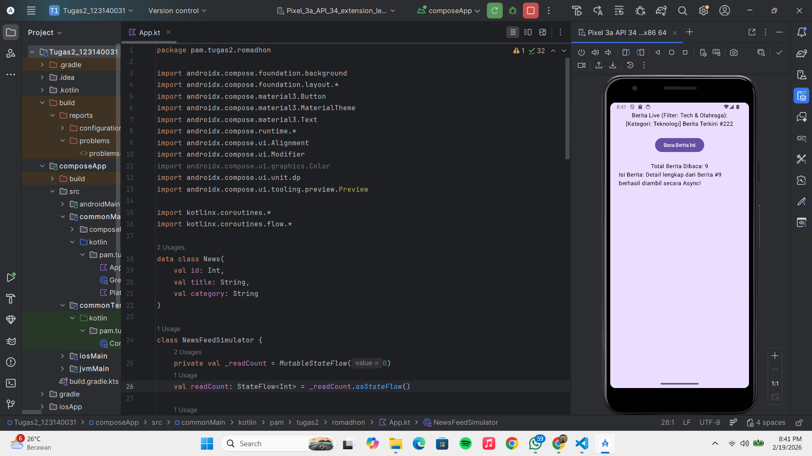
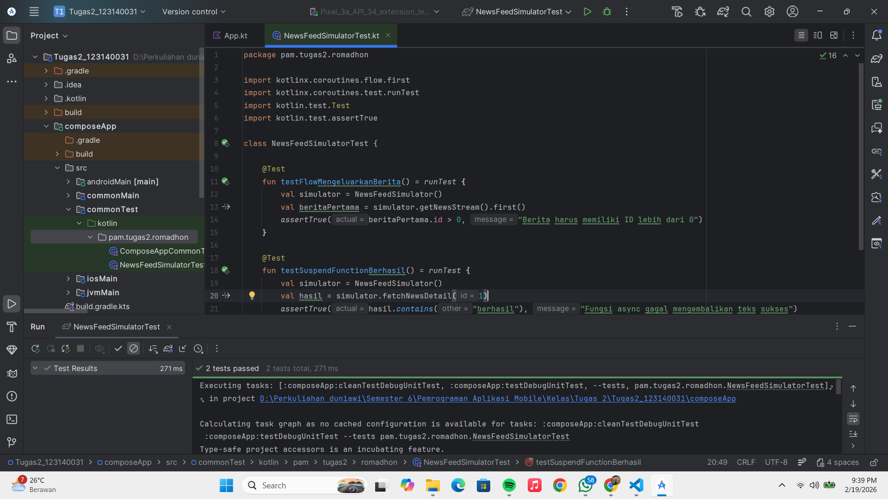

# Tugas 2 Pengembangan Aplikasi Mobile

**Nama:** Muhammad Romadhon Santoso
**NIM:** 123140031
**Kelas:** Pengembangan Aplikasi Mobile RB

## Deskripsi Aplikasi
Aplikasi "News Feed Simulator" ini adalah implementasi dari materi Advanced Kotlin, Coroutines, dan Flow. Aplikasi ini menyimulasikan aliran data berita yang muncul setiap 2 detik menggunakan `Flow`, menyaring kategori berita menggunakan operator `filter` dan `map`, mengelola status jumlah berita yang dibaca menggunakan `StateFlow`, serta mengambil detail berita secara *asynchronous* menggunakan `Coroutines` (async/await).

## Screenshot Aplikasi

## Bonus Implementasi (+10%)
1. **Error Handling**: Menambahkan blok `try-catch` pada pemanggilan Coroutines dan operator `.catch` pada aliran Flow untuk mencegah aplikasi *crash* saat terjadi kegagalan sistem.
2. **Unit Test**: Membuat skrip pengujian otomatis menggunakan library `kotlinx-coroutines-test` untuk memvalidasi fungsi `suspend` dan keluaran data dari `Flow`.

### Bukti Unit Test Berhasil
